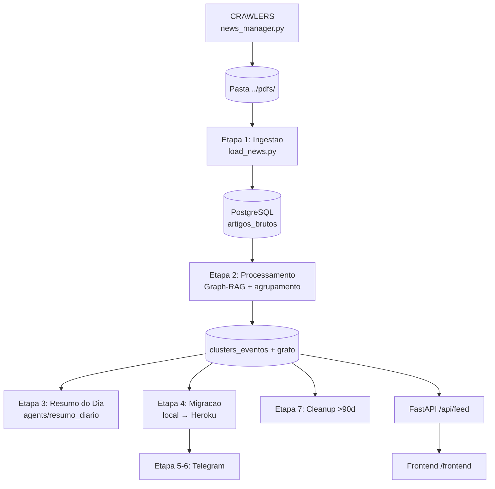

# BTG AlphaFeed v3.0

Plataforma de inteligencia de mercado multi-tenant que transforma alto volume de noticias (~1000/dia) em um feed orientado a eventos (clusters) para Special Situations, com resumos diarios personalizados por usuario.

> **Documentacao completa:** [`docs/SYSTEM.md`](docs/SYSTEM.md) | [`docs/OPERATIONS.md`](docs/OPERATIONS.md) | [`docs/AGENTE_RESUMO_DIARIO_SPEC.md`](docs/AGENTE_RESUMO_DIARIO_SPEC.md)

## O que e

- Identifica o fato gerador por tras de multiplas noticias e consolida em um unico evento (cluster).
- Classifica por prioridade (P1 critico, P2 estrategico, P3 monitoramento) e por tags tematicas.
- Gera resumos diarios **personalizados por usuario** (preferencias de tags, tamanho e template).
- Separacao entre noticias nacionais e internacionais com tags e criterios de priorizacao especificos.
- Crawlers automatizados para fontes online (Valor Economico, Jota, Conjur, Brazil Journal, Migalhas).
- Limpeza automatica de dados antigos (>90 dias), preservando resumos.

## Arquitetura

```
Frontend (HTML/CSS/JS)  ←→  FastAPI + SQLAlchemy  ←→  PostgreSQL
                                    ↕
                           Gemini 2.0 Flash (LLM)
                                    ↕
                            Graph-RAG v2 (NER + Embeddings)
```

- **Backend**: FastAPI + SQLAlchemy + PostgreSQL (Heroku)
- **LLM**: Gemini 2.0 Flash (extracao, agrupamento, classificacao, resumo)
- **Auth**: JWT (python-jose + passlib) — multi-tenant com usuarios, preferencias e templates
- **Pipeline**: `run_complete_workflow.py` (crawlers → ingestao → processamento → resumo → migracao → notificacao → cleanup)
- **Deploy**: Heroku (gunicorn + PostgreSQL). Sync via `migrate_incremental.py`

## Novidades v3.0

- **Multi-Tenant**: Cadastro de usuarios com JWT, preferencias individuais (tags de interesse, tamanho de resumo)
- **Resumo Personalizado**: Agente de IA gera resumo diario customizado por usuario via `gerar_resumo_para_usuario()`
- **Hero Section**: Resumo do dia exibido no topo do frontend com botao de regeneracao
- **Onboarding**: Modal automatico para novos usuarios configurarem suas preferencias
- **Crawlers**: Coleta automatizada de noticias de 5+ fontes online (CRAWLERS/src/news_manager.py)
- **Telegram Listener**: Escuta grupos Telegram e baixa PDFs automaticamente (`TELEGRAM_LISTENER/`, ver README da pasta)
- **Micro-batch**: Processamento incremental de PDFs com lock file anti-race-condition
- **Web Search**: Tool Tivaly para agentes buscarem informacoes complementares
- **Cleanup Automatico**: Remove dados com mais de 90 dias do banco, preservando resumos
- **CMS de Prompts**: Administradores editam prompts via frontend com validacao de integridade

## Setup Rapido

### Pre-requisitos

- Python 3.11 (Anaconda recomendado, ambiente `pymc2`)
- PostgreSQL local na porta `5433`

### Configuracao

1. Crie `backend/.env`:
```env
DATABASE_URL="postgresql+psycopg2://postgres_local@localhost:5433/devdb"
GEMINI_API_KEY="<sua_chave_gemini>"
JWT_SECRET="<chave_secreta_jwt>"
```

2. Instale dependencias:
```bash
conda activate pymc2
pip install -r requirements.txt
```

3. Migre o banco:
```bash
python migrate_incremental.py
```

### Variaveis de Ambiente

| Variavel | Obrigatoria | Descricao |
|----------|:-----------:|-----------|
| `DATABASE_URL` | Sim | Conexao PostgreSQL |
| `GEMINI_API_KEY` | Sim | API Gemini para LLM |
| `JWT_SECRET` | Nao | Chave JWT (fallback automatico) |
| `TIVALY_API_KEY` | Nao | Web search nos agentes |
| `TELEGRAM_BOT_TOKEN` | Nao | Notificacoes Telegram |
| `TELEGRAM_CHAT_ID` | Nao | Canal Telegram |
| `ADMIN_INITIAL_PASSWORD` | Nao | Senha admin inicial (default: admin) |

## Pipeline (passo a passo)

```bash
python run_complete_workflow.py           # ciclo unico
python run_complete_workflow.py --scheduler --interval 60  # loop continuo
python run_complete_workflow.py --microbatch --batch-interval 3  # micro-batch
```

### Etapas internas

| Etapa | Descricao | Script/Funcao |
|:-----:|-----------|---------------|
| 0 | Feedback Learning (ajuste de regras) | `run_feedback_learning()` |
| 0.5 | **Crawlers** — coleta noticias online, gera dump.json | `run_crawlers()` → `CRAWLERS/src/news_manager.py` |
| 1 | Ingestao de PDFs/JSONs com deduplicacao semantica | `run_load_news()` → `load_news.py` |
| 2 | Processamento: agrupamento, classificacao, resumo + Graph-RAG | `run_process_articles()` → `process_articles.py` |
| 3 | **Resumo do Dia** — multi-persona, impresso no terminal | `run_resumo_diario()` → `agents/resumo_diario/agent.py` |
| 4 | Migracao incremental local → Heroku | `run_migrate_incremental()` |
| 5 | Notificacoes Telegram (clusters individuais) | `run_notify()` |
| 6 | Daily Briefing sintetizado (Telegram) | `run_telegram_briefing()` |
| 7 | **Cleanup** — remove dados >90 dias | `run_cleanup(days=90)` |



## Endpoints Principais

### Feed e Conteudo
- `GET /api/feed?data=YYYY-MM-DD` — Feed do dia com clusters e feedback
- `GET /api/feed/updates-since?since=<ISO>` — Novos clusters desde timestamp

### Autenticacao (JWT)
- `POST /api/auth/login` — Login (retorna JWT)
- `POST /api/auth/register` — Registro de novo usuario
- `GET /api/auth/me` — Dados do usuario logado

### Resumo Personalizado
- `GET /api/resumo/hoje` — Resumo do dia do usuario logado
- `POST /api/resumo/gerar` — Gera resumo (background task, async)
- `GET /api/resumo/historico` — Historico de resumos

### Preferencias do Usuario
- `GET /api/user/preferencias` — Preferencias atuais
- `PUT /api/user/preferencias` — Atualiza preferencias (tags, tamanho)

### Admin
- `POST /api/admin/upload-file` — Upload de PDF/JSON (dispara pipeline automaticamente)
- `GET /api/admin/prompts` — Lista prompts editaveis
- `PUT /api/admin/prompts/{chave}` — Edita prompt com validacao

### BI e Feedback
- `GET /api/bi/series-por-dia?dias=30`
- `POST /api/feedback?artigo_id=<id>&feedback=like|dislike`

## Frontend

- **Feed**: `http://localhost:8000/frontend` — Hero Section com resumo + feed de clusters
- **Admin**: `http://localhost:8000/frontend/settings.html` — Prompts, BI, feedback
- **Login**: `http://localhost:8000/frontend/login.html`
- **Docs**: `http://localhost:8000/frontend/docs.html` — Documentacao renderizada (Markdown + Mermaid)

## Crawlers

Subprojeto em `CRAWLERS/` que coleta noticias de fontes online:

| Fonte | Status |
|-------|--------|
| Valor Economico | Ativo |
| Jota | Ativo |
| Conjur | Ativo |
| Brazil Journal | Ativo |
| Migalhas | Ativo |

Credenciais (cookies de sessao) ficam em `CRAWLERS/src/*/credentials.json` — **nunca commitar** (listado no `.gitignore`).

```bash
cd CRAWLERS/src && python news_manager.py  # execucao manual
```

## Sincronizar Local → Heroku

```bash
python migrate_incremental.py \
  --source "postgresql+psycopg2://postgres_local@localhost:5433/devdb" \
  --dest "postgres://<usuario>:<senha>@<host>:5432/<db>" \
  --include-all
```

Flags uteis: `--include-usuarios`, `--include-logs`, `--include-chat`, `--no-update-existing`

## Comandos Rapidos

```bash
python run_complete_workflow.py                              # pipeline completo
python run_complete_workflow.py --scheduler --interval 60    # loop continuo
python run_complete_workflow.py --microbatch --batch-interval 3  # micro-batch com lock
python load_news.py --dir ../pdfs --direct --yes             # ingestao manual
python process_articles.py                                   # processar pendentes
python start_dev.py                                          # iniciar backend
python limpar_banco.py                                       # limpeza interativa
```

## Estrutura de Pastas

```
btg_alphafeed/
├── agents/
│   ├── estagiario/          # Agente de consulta sobre noticias
│   └── resumo_diario/       # Agente de resumo personalizado (v3.0)
│       ├── agent.py          # gerar_resumo_diario + gerar_resumo_para_usuario
│       └── tools/            # obter_textos_brutos + buscar_na_web (Tivaly)
├── backend/
│   ├── main.py              # FastAPI (80+ endpoints, JWT auth)
│   ├── database.py          # 21+ tabelas ORM
│   ├── crud.py              # 100+ funcoes CRUD
│   ├── processing.py        # Pipeline de processamento
│   ├── prompts.py           # Fonte unica de prompts, tags, prioridades
│   ├── models.py            # Pydantic models
│   └── .env                 # Variaveis de ambiente (nao commitar)
├── CRAWLERS/                # Crawlers de noticias online
│   ├── src/                 # Scripts por fonte (Valor, Jota, Conjur, etc.)
│   └── dump/                # Dumps gerados (gitignored)
├── frontend/
│   ├── index.html           # Feed + Hero Section resumo
│   ├── script.js            # 120+ funcoes (fetchAuth, onboarding, resumo)
│   ├── settings.html        # Admin (prompts, BI, feedback)
│   ├── login.html           # Autenticacao JWT
│   └── docs.html            # Documentacao renderizada
├── docs/                    # Documentacao tecnica
├── run_complete_workflow.py # Orquestrador principal
├── process_articles.py      # Pipeline v1 (4 etapas)
├── load_news.py             # Ingestao de PDFs/JSONs
├── migrate_incremental.py   # Sync local → Heroku
└── requirements.txt         # Dependencias Python
```

## Seguranca

- Credenciais NUNCA no Git (`.env`, `credentials.json` — tudo no `.gitignore`)
- JWT com expiracao configuravel
- Roles: admin vs usuario regular
- Validacao de prompts: sandbox `format()` antes de salvar (previne `KeyError`)

## Troubleshooting

| Problema | Solucao |
|----------|---------|
| Sem `GEMINI_API_KEY` | PDFs ingeridos como 1 artigo/pagina (fallback) |
| Conexao DB falha | Confirme porta `5433` e `DATABASE_URL` |
| Sem artigos pendentes | Rode `load_news.py` primeiro |
| Crawlers falham | Verifique cookies em `CRAWLERS/src/*/credentials.json` |
| Resumo demora | Endpoint async — frontend faz polling automatico |
| Lock file preso | Delete `.microbatch.lock` manualmente |
