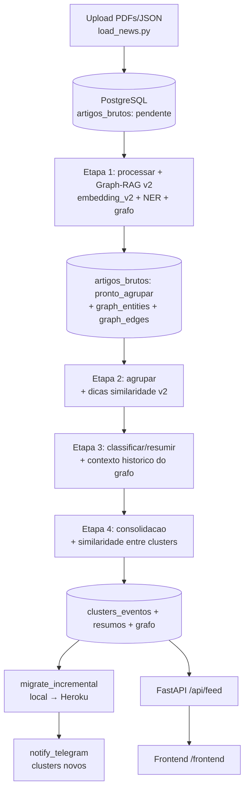

## BTG AlphaFeed

Plataforma de inteligencia de mercado que transforma alto volume de noticias (~1000/dia) em um feed orientado a eventos (clusters) para Special Situations, com suporte para noticias nacionais e internacionais.

> **Documentacao completa:** [`docs/SYSTEM.md`](docs/SYSTEM.md) (arquitetura e referencia) | [`docs/OPERATIONS.md`](docs/OPERATIONS.md) (setup e API) | [`docs/V2-MIGRATION-PLAN.md`](docs/V2-MIGRATION-PLAN.md) (Graph-RAG v2)

### O que e (visao executiva)

- Identifica o fato gerador por tras de multiplas noticias e consolida em um unico evento.
- Classifica por prioridade (P1 critico, P2 estrategico, P3 monitoramento) e por categoria tematica (tags).
- Gera resumos executivos no tamanho certo por prioridade (P1 longo, P2 medio, P3 curto).
- Oferece visualizacao por data, filtros e drill-down para as fontes originais.
- Separacao entre noticias nacionais e internacionais com tags e criterios de priorizacao especificos.
- **NOVO v2.0**: Arquitetura Graph-RAG Agentica com memoria temporal (grafo de conhecimento + LangGraph).

### Como funciona na prática

- Carregue PDFs/JSONs de crawlers (upload manual ou via API) → são salvos como artigos brutos com **texto original completo** preservado.
- O processamento orquestrado agrupa por fato gerador, classifica e gera resumos dos **clusters** (não das notícias individuais).
- O frontend exibe o feed por data, com filtros de prioridade e tags dinâmicas vindas dos dados reais.

### Novidades recentes (pipeline mais rigoroso)

- **Suporte a notícias internacionais**: Sistema de abas Brasil/Internacional no frontend com:
  - Detecção automática do tipo de fonte (nacional/internacional) baseada no jornal (com heurística ampliada para FT/WSJ/NYT/Bloomberg etc.)
  - Tags específicas para contexto internacional (ex: "Global M&A", "Central Banks and Monetary Policy")
  - Critérios de priorização adaptados para mercado global (valores em dólares, empresas Fortune 500)
  - Filtros independentes por tipo de fonte na API
- **Preservação do texto original**: O `texto_bruto` dos PDFs é **NUNCA alterado** durante o processamento, garantindo acesso ao conteúdo original completo.
- **Resumos de clusters**: O `texto_processado` contém resumos dos **clusters de eventos**, não de notícias individuais.
- Endurecimento do `PROMPT_EXTRACAO_PERMISSIVO_V8`: lista de rejeição ampliada (crimes comuns, casos pessoais, fofoca/entretenimento, esportes, política partidária, efemérides e programas sociais sem tese) e gating P1/P2/P3 mais duro.
- Priorização Executiva Final integrada: etapa adicional pós-resumo/pós-agrupamento que reclassifica como P1/P2/P3/IRRELEVANTE com justificativa e ação recomendada (`PROMPT_PRIORIZACAO_EXECUTIVA_V1`).
- Nova Etapa 4 – Consolidação Final de Clusters: reagrupamento conservador de clusters do dia usando `PROMPT_CONSOLIDACAO_CLUSTERS_V1` com base em títulos, tags e prioridades já atribuídos. A maioria dos clusters permanece inalterada; quando há duplicidade (p.ex. variações de "PGFN arrecadação recorde"), a etapa sugere merges, move artigos para um destino, ajusta título/tag/prioridade quando necessário e arquiva (soft delete) os duplicados.
- Robustez: ajustes para evitar truncamento do LLM e JSON quebrado — lotes menores, campos de resumo encurtados e fallback de parsing.
  - Incremental: lotes de até 100, `titulos_internos` reduzido a 10 por cluster, heurística que impede criação de múltiplos clusters genéricos (ex.: "Notícia sem título"). Processamento incremental e em lote agora separam por tipo_fonte (NACIONAL/INTERNACIONAL) — nunca se misturam no mesmo prompt.
  - Priorização: lotes de até 40, `resumo_final` enviado truncado a ~240 caracteres, `max_output_tokens` 8192 para batched.
  - Consolidação: lotes de até 50; parsing de sugestões tolerante a erros; fallback determinístico por título/tag.

### Filtros e visualização (frontend)

- **Abas Brasil/Internacional**: Separa notícias por tipo de fonte com filtros independentes.
- Card do Estagiário otimizado: design mais compacto com título e descrição na mesma linha.
- Seletor de data no topo: alterna entre hoje e datas históricas (tudo GMT-3).
- Filtros: prioridade (P1/P2/P3) e tags dinâmicas (derivadas dos clusters reais).
- P3 Monitoramento: cards consolidados por tag com lista em bullets; clique abre modal com detalhes.
- Deep-dive: modal por evento com resumo, fontes e abas (chat com cluster e gerenciamento).

### Tags e Prioridades (como configurar)

- **Configuração via Frontend**: Acesse `/frontend/settings.html` → aba "Prompts" para editar tags e prioridades de forma visual e intuitiva.
- **Persistência no Banco**: Tags e prioridades são agora armazenadas no PostgreSQL, permitindo edições em produção sem perda de dados.
- **Estrutura das Tags**: Cada tag tem nome, descrição, exemplos e ordem de exibição.
- **Estrutura das Prioridades**: Itens organizados por nível (P1_CRITICO, P2_ESTRATEGICO, P3_MONITORAMENTO) com descrições personalizáveis.
- **Fallback Automático**: O sistema carrega do banco de dados, mas mantém compatibilidade com as estruturas originais do `backend/prompts.py`.
- **Migração**: Use `python seed_prompts.py` para popular o banco com dados iniciais após criar as tabelas.

### Pipeline (passo a passo) — v2.0 Graph-RAG Integrado

O pipeline e executado via `run_complete_workflow.py` que orquestra todas as etapas:

```bash
python run_complete_workflow.py           # ciclo unico (ingestao + processamento + migracao + notificacao)
python run_complete_workflow.py --scheduler --interval 60  # loop continuo (de hora em hora)
```

**Etapas internas (executadas automaticamente):**

1) **Ingestao** (`load_news.py`)
   - PDFs: usa `PROMPT_EXTRACAO_PDF_RAW_V1` para extrair TEXTO COMPLETO ORIGINAL (sem resumo)
   - JSONs: ingeridos diretamente sem LLM
   - Deduplicacao semantica via `embedding_v2` (768d Gemini) — rejeita artigos com >85% de similaridade
   - Salva como artigos brutos (status `pendente`) com `texto_bruto` preservado
2) **Processamento + Enriquecimento Graph-RAG** (Etapa 1)
   - `process_articles.py::processar_artigo_sem_cluster` + `enriquecer_artigo_v2`
   - Valida dados, aplica heuristicas leves, gera embedding v1 (384d hash)
   - **v2**: Gera `embedding_v2` (768d Gemini), extrai entidades via LLM (NER), resolve nomes canonicos e persiste no grafo (`graph_entities` + `graph_edges`)
   - Marca `pronto_agrupar`
3) **Agrupamento + Dicas de Similaridade** (Etapa 2)
   - Lote: `agrupar_noticias_com_prompt` → `PROMPT_AGRUPAMENTO_V1`
   - Incremental: `agrupar_noticias_incremental` → `PROMPT_AGRUPAMENTO_INCREMENTAL_V2`
   - **v2**: Calcula similaridade cosseno entre artigos via `embedding_v2` e injeta DICAS DE SIMILARIDADE no prompt (ex: "Noticias 3 e 7 tem 92% de similaridade semantica")
   - Isolado por tipo_fonte (NACIONAL/INTERNACIONAL nunca se misturam)
4) **Classificacao, Resumo + Contexto Historico** (Etapa 3)
   - `classificar_e_resumir_cluster` → `PROMPT_ANALISE_E_SINTESE_CLUSTER_V1`
   - **v2**: Busca contexto historico via `get_context_for_cluster()` (grafo: entidades 7 dias + vetorial: artigos similares 30 dias) e injeta no prompt como CONTEXTO HISTORICO. Permite resumos como "Este e o terceiro anuncio do tipo nesta semana..."
5) **Consolidacao + Similaridade de Clusters** (Etapa 4)
   - `consolidacao_final_clusters` → `PROMPT_CONSOLIDACAO_CLUSTERS_V1`
   - **v2**: Calcula embedding medio por cluster (media dos `embedding_v2` dos artigos) e identifica pares com alta similaridade para sugerir merges mais inteligentes
6) **Migracao** → Sincroniza local → Heroku (`migrate_incremental --include-all`)
7) **Notificacoes** → Envia clusters novos via Telegram (se configurado)
8) **Exposicao**: API `FastAPI` alimenta o frontend; CRUD e endpoints admin.


```mermaid
graph TD
  A[Upload PDFs/JSON<br/>load_news.py] --> B[(PostgreSQL<br/>artigos_brutos: pendente)]
  B --> C[Etapa 1: processar + Graph-RAG v2<br/>embedding_v2 + NER + grafo]
  C --> D[(artigos_brutos: pronto_agrupar<br/>+ graph_entities + graph_edges)]
  D --> E[Etapa 2: agrupar<br/>+ dicas similaridade v2]
  E --> F[Etapa 3: classificar/resumir<br/>+ contexto historico do grafo]
  F --> F2[Etapa 4: consolidacao<br/>+ similaridade entre clusters]
  F2 --> G[(clusters_eventos + resumos + grafo)]
  G --> M[migrate_incremental<br/>local → Heroku]
  M --> T[notify_telegram<br/>clusters novos]
  G --> H[FastAPI /api/feed]
  H --> I[Frontend /frontend]
```

### LLMs e prompts (o que roda e para que)

- Extracao de PDFs: `PROMPT_EXTRACAO_PDF_RAW_V1`
- **v2 NER (Etapa 1)**: `PROMPT_ENTITY_EXTRACTION` — extrai entidades (PERSON, ORG, GOV, EVENT, CONCEPT) via Gemini Flash
- **v2 Embedding (Etapa 1)**: `gemini-embedding-001` — gera embedding_v2 de 768 dimensoes para cada artigo
- Agrupamento em lote: `PROMPT_AGRUPAMENTO_V1` + **dicas de similaridade v2**
- Agrupamento incremental: `PROMPT_AGRUPAMENTO_INCREMENTAL_V2` + **dicas de similaridade v2**
- Classificacao e resumo (Etapa 3): `PROMPT_ANALISE_E_SINTESE_CLUSTER_V1` + **contexto historico do grafo v2**
- Consolidacao final (Etapa 4): `PROMPT_CONSOLIDACAO_CLUSTERS_V1` + **similaridade entre clusters v2**
- Chat com cluster: `PROMPT_CHAT_CLUSTER_V1`

### Busca Semântica (novo módulo)

- Pacote: `btg_alphafeed/semantic_search/` com:
  - `embedder.py`: geração de embeddings (`text-embedding-3-small` via OpenAI se disponível; fallback determinístico).
  - `store.py`: persistência em `semantic_embeddings` (tabela dedicada, não interfere no pipeline atual).
  - `search.py`: busca por similaridade de cosseno em memória (compatível sem pgvector).
  - `backfill_embeddings.py`: utilitário CLI para gerar embeddings dos artigos existentes.
- Integração com o agente Estagiário: nova tool `semantic_search(consulta, limite?, modelo?)` para consultas abertas.
- Como rodar o backfill:
  ```bash
  conda activate pymc2
  python -m btg_alphafeed.semantic_search.backfill_embeddings --limit 1000 --model text-embedding-3-small
  ```

### Agente Estagiário: plano → execução (agentic)

- O agente agora opera com camadas LLM para planejar e executar:
  1. Entender intenção (consultar notícias, ADMIN, EDIÇÃO no DB, ou ANÁLISE DE FEEDBACK)
  2. Se EDIÇÃO (trocar tag/prioridade):
     - Entende operação via LLM (JSON: operation/cluster_id/cluster_title/new_tag/new_priority)
     - Se não houver `new_tag`/`new_priority`, consulta o LLM com o CATÁLOGO do banco e o contexto do cluster para decidir a tag/prioridade corretas
     - Resolve o cluster por ID ou título parcial do dia e aplica via CRUD
  3. Se ANÁLISE DE FEEDBACK (ex.: "quais notícias têm reforço positivo?"):
     - Busca notícias com likes/dislikes do dia
     - Lista títulos e informações para ajuste de prompts
     - Fornece estatísticas de aprovação
  4. Se CONSULTA (ex.: "quero trocar de carro para um elétrico, tem promoção?"):
     - Pede ao LLM um SPEC JSON de busca (priorities/tags/keywords)
     - Coleta candidatos do DB, triagem via LLM, aprofunda top-K e sintetiza resposta

Endpoints do agente

- `POST /api/estagiario/start`, `POST /api/estagiario/send`, `GET /api/estagiario/messages/{session_id}`

Prompts opcionais/POC (não usados no pipeline padrão):

- `PROMPT_RESUMO_CRITICO_V1` (POC de resumo crítico)
- `PROMPT_RADAR_MONITORAMENTO_V1` (POC de bullets de radar P3)
- `PROMPT_AGRUPAMENTO_INCREMENTAL_V1` (substituído por `V2` no pipeline)
- `PROMPT_SANITIZACAO_CLUSTER_V1` (disponível como segunda linha de defesa; não integrado por padrão)
- `PROMPT_EXTRACAO_JSON_V1` (alias de `PROMPT_EXTRACAO_PERMISSIVO_V8`, mantido para compatibilidade)
- Onde ajustar: `backend/prompts.py` (textos, tags, prioridades). API key via `backend/.env` (`GEMINI_API_KEY`).

### Arquitetura em 1 minuto

- Backend FastAPI + SQLAlchemy (PostgreSQL 5433)
- **Estrutura de dados**: `artigos_brutos` (texto original dos PDFs) → `clusters_eventos` (resumos dos clusters)
  - **NOVO**: Coluna `tipo_fonte` em ambas as tabelas para separar notícias nacionais/internacionais
- **Preservação de dados**: `texto_bruto` nunca é alterado; `texto_processado` contém resumos dos clusters
- Frontend estático em `frontend/`
- Orquestração por scripts CLI para ingestão e processamento

## Guia Rápido

### Pré-requisitos

- Anaconda instalado; usar o ambiente `pymc2`
- PostgreSQL local ativo na porta `5433`
- `backend/.env` com variáveis mínimas:
  ```env
  DATABASE_URL="postgresql+psycopg2://postgres_local@localhost:5433/devdb"
  GEMINI_API_KEY="<sua_chave_gemini>"
  ```

### 1) Ativar ambiente e entrar no projeto

```bash
conda activate pymc2
cd "C:\Users\marcos.silva\OneDrive - ENFORCE GESTAO DE ATIVOS S.A\jupyter\projetos\novo-topnews\pdfs\silva-front\btg_alphafeed"
```

### 2) Migração do banco de dados (NOVO - executar uma vez)

Se você já tem um banco existente, execute a migração para adicionar suporte a notícias internacionais:

```bash
python add_tipo_fonte_migration.py
```

### 3) Comandos essenciais

- **Pipeline completo (recomendado)** — ingestao + processamento v2 + migracao + notificacao:

```bash
python run_complete_workflow.py
```

- **Pipeline em loop** (de hora em hora, para operacao continua):

```bash
python run_complete_workflow.py --scheduler --interval 60
```

- Upload manual de PDFs/JSON (diretorio completo):

```bash
python load_news.py --dir ../pdfs --direct --yes
```

- Processar artigos isoladamente (sem migracao/notificacao):

```bash
python process_articles.py
```

- Iniciar o backend (use apenas se nao houver outro servidor rodando):

```bash
python start_dev.py
```

- Acesso rapido: Frontend `http://localhost:8000/frontend` | Docs `http://localhost:8000/docs` | Health `http://localhost:8000/health`

### Estimativa de Custos (LLM)

Para uma estimativa rápida de custos por etapa do pipeline, execute:

```bash
python estimativa_custos.py
```

O script simula tokens de entrada/saída por etapa usando as notícias no banco e imprime um comparativo por cenário de modelos.

## Sincronizar Banco Local → Heroku (Incremental)

Rodar a partir da pasta `silva-front` ou `btg_alphafeed`:

```bash
  conda activate pymc2
  python -m btg_alphafeed.migrate_incremental \
    --source "postgresql+psycopg2://postgres_local@localhost:5433/devdb" \
    --dest   "postgres://<usuario>:<senha>@<host>:5432/<db>" \
    --include-logs --include-chat
```

- Opções úteis:
  - `--no-update-existing`: não atualiza registros existentes (apenas insere novos)
  - `--since <ISO-UTC>`: inicia a partir de um timestamp específico
  - `--meta-file btg_alphafeed/last_migration.txt`: armazena o último timestamp migrado
  - `--only clusters,artigos,logs`: restringe entidades

### Replace do dia (produção) com reprocessamento local

Use quando você reprocessou o dia localmente (novos prompts) e quer substituir o dia em produção de forma limpa (sem manter clusters antigos do mesmo dia).

Passo a passo:

1. Reprocessar localmente o dia (mantém brutos, limpa processados de hoje e reprocessa o pipeline completo):

   ```bash
   conda activate pymc2
   cd btg_alphafeed
   python reprocess_today.py
   ```
2. Replace no destino (produção) APENAS do dia desejado:

   ```bash
   conda activate pymc2
   cd btg_alphafeed
   python migrate_replace_today.py \
     --source "postgresql+psycopg2://postgres_local@localhost:5433/devdb" \
     --dest   "postgres://<usuario>:<senha>@<host>:5432/<db>" \
     --day $(python -c "from datetime import date; print(date.today().isoformat())")
   ```

   O utilitário limpa no destino os dados do dia (desassocia artigos, remove clusters/alterações/chat/síntese do dia) e migra do origem os clusters/artigos/síntese do mesmo dia, forçando `cluster_id` dos artigos.
3. (Opcional) Rodar incremental normal para demais dias/logs/chat:

   ```bash
   python -m btg_alphafeed.migrate_incremental \
     --source "postgresql+psycopg2://postgres_local@localhost:5433/devdb" \
     --dest   "postgres://<usuario>:<senha>@<host>:5432/<db>" \
     --include-logs --include-chat
   ```

## Suporte a Notícias Internacionais (NOVO)

O sistema agora diferencia automaticamente entre fontes nacionais e internacionais:

**Detecção Automática de Fonte**:

- Jornais nacionais: Folha, Estadão, O Globo, Valor, etc.
- Jornais internacionais: NYT, WSJ, Financial Times, Bloomberg, etc.
- Default: nacional (para compatibilidade com dados existentes)

**Tags Internacionais Disponíveis**:

- Global M&A and Corporate Transactions
- Global Legal and Regulatory
- Sovereign Debt and Credit
- Global Distressed and Restructuring
- Global Capital Markets
- Central Banks and Monetary Policy
- Geopolitics and Trade
- Technology and Innovation

**Critérios de Priorização Internacional**:

- P1: Defaults soberanos > $5B, Chapter 11 de Fortune 500, mega-mergers > $20B
- P2: Mudanças de rating de países G20, M&As cross-border > $5B
- P3: Earnings regulares, indicadores econômicos, desenvolvimentos políticos

## Tarefas Comuns

- Pipeline completo (recomendado):

```bash
python run_complete_workflow.py
```

- Limpar banco (script interativo, com backup):

```bash
python limpar_banco.py
```

- Ver estado da API e DB:

```bash
curl http://localhost:8000/health
```

### Reprocessamento seletivo (do dia atual)

- Reverter clusters problemáticos (move artigos para `pronto_agrupar` e arquiva clusters):
  ```bash
  # Seleção automática por títulos genéricos (ex.: "Notícia sem título")
  python revert_bad_clusters.py
  # OU por IDs específicos
  python revert_bad_clusters.py --ids 8349,8350
  ```
- Reagrupar apenas os revertidos e concluir Etapas 3 e 4:
  ```bash
  python reprocess_incremental_today.py
  ```

### Novo (Protótipo) – Análise de Feedback para Ajuste de Prompt

- Agora é possível registrar like/dislike de notícias diretamente no feed (👍/👎 ao lado do título de cada card). O backend agrega esse feedback por cluster e expõe no `GET /api/feed` dentro do campo `feedback` de cada item: `{ likes, dislikes, last }`.
- Foi adicionado um protótipo de análise de feedback que sugere ajustes no prompt de agrupamento sem alterar os arquivos em produção. Ele gera um relatório com o diff do prompt proposto.

Rodar o protótipo de análise de feedback e gerar diff do prompt:

```bash
conda activate pymc2
python analisar_feedback_prompt.py --limit 200 --output reports/prompt_diff_feedback.md
```

Saída esperada:

- Arquivo `reports/prompt_diff_feedback.md` com:
  - Prompt atual
  - Prompt proposto (adiciona addendum baseado em padrões de like/dislike)
  - Diff (unified) entre os dois para revisão humana

Importante: este processo não altera `backend/prompts.py`. É apenas para estudo e validação.

## Playbooks (cenarios prontos)

### 1) Pipeline completo do dia (RECOMENDADO)

```bash
conda activate pymc2
cd btg_alphafeed
python run_complete_workflow.py
# Executa: ingestao PDFs → processamento v2 (Graph-RAG) → migracao Heroku → notificacoes
```

### 2) Pipeline em loop (operacao continua, de hora em hora)

```bash
conda activate pymc2
cd btg_alphafeed
python run_complete_workflow.py --scheduler --interval 60
# Deduplicacao semantica garante que artigos repetidos nao sao reprocessados
```

### 3) Reprocessar apenas pendentes (sem ingestao, sem migracao)

```bash
conda activate pymc2
cd btg_alphafeed
python process_articles.py
```

### 4) Sincronizar local → Heroku (manual)

```bash
conda activate pymc2
cd btg_alphafeed
python -m migrate_incremental \
  --source "postgresql+psycopg2://postgres_local@localhost:5433/devdb" \
  --dest   "postgres://<usuario>:<senha>@<host>:5432/<db>" \
  --include-all
```

### 5) Backfill do grafo (uma vez, apos setup inicial)

```bash
python scripts/backfill_graph.py --days 30 --batch 50
```

### 6) Verificar data sem dados (sanidade)

```bash
curl "http://localhost:8000/api/feed?data=2099-01-01"
# Esperado: metricas zeradas e lista vazia
```

## Regras de Negócio e Convenções

- Tags: usar apenas as definidas em `backend/prompts.py` (`TAGS_SPECIAL_SITUATIONS`)
- JSONs de crawlers: ingestão direta; LLM só na fase de agrupamento/síntese
- `process_articles.py`: orquestra e chama a lógica do backend; sem regras de negócio próprias
- Status dos artigos: `pendente` → `pronto_agrupar` → `processado`
- Prioridades e resumos: P1 (longo), P2 (médio), P3 (curto)

## Endpoints principais

- `GET /api/feed?data=YYYY-MM-DD`
  - Cada item do feed inclui `feedback: { likes, dislikes, last }` agregados por cluster
- `POST /admin/processar-pendentes`
- `POST /api/admin/upload-file` e `GET /admin/upload-progress/{file_id}`
- `GET /health`
- Frontend servido em `/frontend`

### Endpoints de BI e Feedback

- `GET /api/bi/series-por-dia?dias=30`
- `GET /api/bi/noticias-por-fonte?limit=20`
- `GET /api/bi/noticias-por-autor?limit=20`
- `POST /api/feedback?artigo_id=<id>&feedback=like|dislike`
- `GET /api/feedback?processed=`
- `POST /api/feedback/{id}/process`

## Dicas de Ambiente

- Sempre usar Anaconda Prompt e `conda activate pymc2`
- Porta padrão do Postgres local: `5433`
- Evite subir o backend se já existir um servidor rodando

## Troubleshooting (rápido)

- Sem `GEMINI_API_KEY`: PDFs são ingeridos como 1 artigo por página (fallback)
- Conexão DB falhando: confirme porta `5433` e `DATABASE_URL`
- Sem artigos pendentes: rode primeiro o upload (`load_news.py`)
- API offline: use o modo `--direct` do `load_news.py`

## Testes

```bash
python tests/test_imports.py
python test_fluxo_completo.py
```

## Segurança

- Nunca commitar `.env` ou credenciais
- Evite colar URLs de produção com usuário/senha em documentos/commits

## Formatos suportados (resumo)

- JSON de crawlers: campos típicos `id_hash`, `titulo`, `texto_completo`, `link`, `fonte`, `data_publicacao`
- PDF: OCR + LLM quando disponível; fallback 1 artigo por página

## Referencias rapidas

- **Pipeline completo**: `python run_complete_workflow.py` (ingestao + processamento v2 + migracao + notificacao)
- **Pipeline loop**: `python run_complete_workflow.py --scheduler --interval 60`
- Upload manual: `python load_news.py --dir ../pdfs --direct --yes`
- Processar somente: `python process_articles.py`
- Backend: `python start_dev.py`
- Migracao Heroku: `python -m migrate_incremental --source "..." --dest "..." --include-all`

---

## Documentação para LLMs (manutenção e navegação do código)

### Mapa de pastas (o que cada uma faz)

- `btg_alphafeed/backend/main.py`: aplicação FastAPI, rotas principais (`/api/feed`, admin, upload, health), serve frontend e orquestra background tasks.
- `btg_alphafeed/backend/database.py`: engine, sessões, modelos SQLAlchemy, helpers de conexão e utilidades de schema.
- `btg_alphafeed/backend/crud.py`: operações de banco de dados (artigos, clusters, associações, atualizações de status, métricas, logs).
- `btg_alphafeed/backend/processing.py`: pipeline de processamento unitário (embeddings, similaridade, processamento de artigo, resumo de cluster, utilitários de cluster).
- `btg_alphafeed/backend/models.py`: modelos Pydantic para request/response.
- `btg_alphafeed/backend/prompts.py`: fonte da verdade de `TAGS_SPECIAL_SITUATIONS`, `LISTA_RELEVANCIA_HIERARQUICA` e todos os prompts de LLM.
- `btg_alphafeed/backend/utils.py`: utilidades gerais (datas GMT-3, etc.).
- `btg_alphafeed/backend/collectors/file_loader.py`: classe `FileLoader` usada por `load_news.py` para ingerir PDFs/JSONs.
- `btg_alphafeed/frontend/index.html|script.js|style.css`: UI do feed, seletor de data, modal de deep-dive, filtros dinâmicos.
- `btg_alphafeed/frontend/settings.html|settings.js`: UI administrativa/CRUD e operações de manutenção, com abas de BI (séries por dia, por fonte e por autor) e Feedback (like/dislike por artigo, com marcação de processado).
- `btg_alphafeed/load_news.py`: CLI para ingestão de PDFs/JSONs (salva artigos brutos, com `--direct` para DB).
- `btg_alphafeed/process_articles.py`: orquestrador do pipeline v2 (processar + enriquecer Graph-RAG → agrupar com dicas similaridade → classificar/resumir com contexto historico → consolidar com similaridade clusters).
- `btg_alphafeed/run_complete_workflow.py`: ponto de entrada principal. Orquestra: ingestao → processamento → migracao → notificacao. Suporta `--scheduler` para loop continuo.
- `btg_alphafeed/migrate_incremental.py`: sync incremental local → Heroku (idempotente, com filtros `--only`, `--include-logs`, `--include-chat`).
- `btg_alphafeed/migrate_databases.py`: migração completa (one-shot) local → Heroku.
- `btg_alphafeed/limpar_banco.py`: limpeza seletiva com backup.

### Fluxos criticos (pontos de extensao)

- Ingestao: estender `backend/collectors/file_loader.py` para novas fontes/formatos.
- Classificacao/Tags: alterar apenas `backend/prompts.py` e manter coerencia com `TAGS_SPECIAL_SITUATIONS`.
- Prioridade/Resumo: `backend/prompts.py` (PROMPT_RESUMO_*), tamanho conforme P1/P2/P3.
- Agrupamento incremental: `PROMPT_AGRUPAMENTO_INCREMENTAL_V2` + dicas de similaridade v2 em `process_articles.py`.
- Enriquecimento v2 (NER + embeddings + grafo): `process_articles.py::enriquecer_artigo_v2` + `backend/agents/graph_crud.py`.
- Contexto historico (Etapa 3): `backend/agents/graph_crud.py::get_context_for_cluster` injeta grafo + vetorial no prompt.
- API/Endpoints: adicionar rotas em `backend/main.py` e delegar CRUD para `backend/crud.py`.

### Regras de contribuição (para evitar duplicação e lógica fora do lugar)

- Orquestração em scripts (CLI): `load_news.py` e `process_articles.py` apenas chamam o backend.
- Lógica de negócio: `backend/processing.py` + `backend/crud.py` (nunca em CLI nem em rotas diretamente). A lógica de consolidação (Etapa 4) usa utilitários em `backend/crud.py` para merges seguros: `merge_clusters`, `update_cluster_title`, `update_cluster_priority`, `update_cluster_tags` e `soft_delete_cluster`.
- Esquema de dados (DB): `backend/database.py` (modelos/relacionamentos) e migrations externas quando necessário.
- Prompts/taxonomia: `backend/prompts.py` (fonte única). O frontend consome tags vindas dos dados reais (sem listas fixas).

### Consulta rápida de responsabilidades

- Gerar resumo de um cluster: `backend/processing.py::gerar_resumo_cluster`
- Associar artigo a cluster: `backend/crud.py::associate_artigo_to_cluster`
- Buscar feed por data: `backend/main.py::get_feed`
- Upload via API: `backend/main.py::upload_file_endpoint` e progresso em `upload_progress`
- Processar pendentes (admin): `backend/main.py::processar_artigos_pendentes` → chama funções do pipeline

## Agente Estagiário (beta)

- O que é: agente de consulta sobre as notícias do dia. Reusa ORM/CRUD do backend e pode sintetizar respostas em Markdown quando `GEMINI_API_KEY` estiver configurada.
- Modo ReAct (opcional): defina `ESTAGIARIO_REACT=1` no ambiente para ativar o executor que orquestra ferramentas formais (`agents/estagiario/tools`).
- Endpoints:
  - `POST /api/estagiario/start` — inicia sessão de chat do dia.
  - `POST /api/estagiario/send` — envia pergunta e retorna resposta do agente.
  - `GET /api/estagiario/messages/{session_id}` — histórico de mensagens.

---

## v2.0 - Arquitetura Graph-RAG Integrada

A v2.0 integra um **Grafo de Conhecimento** e **Embeddings Semanticos** diretamente nas 4 etapas do pipeline principal. Nao e mais um modo sombra separado — o motor v2 e o motor principal.

### Componentes

| Componente                      | Arquivo                             | Descricao                                             |
| ------------------------------- | ----------------------------------- | ----------------------------------------------------- |
| **Grafo de Conhecimento** | `backend/database.py`             | Tabelas `graph_entities` + `graph_edges`          |
| **CRUD do Grafo**         | `backend/agents/graph_crud.py`    | Entity Resolution, arestas, queries temporais, contexto |
| **Nos Agenticos**         | `backend/agents/nodes.py`         | Gatekeeper, NER, Entity Resolution, Historian, Writer |
| **Workflow LangGraph**    | `backend/workflow.py`             | StateGraph (disponivel para debug/comparacao)         |
| **Enriquecimento v2**     | `process_articles.py::enriquecer_artigo_v2` | Embedding + NER + Grafo por artigo (Etapa 1) |
| **Backfill**              | `scripts/backfill_graph.py`       | Popula grafo com dados historicos                     |

### Como o v2 funciona em cada etapa

| Etapa | O que o v2 adiciona | Funcao chave |
|-------|---------------------|--------------|
| **Etapa 1** | Gera `embedding_v2` (768d Gemini) + extrai entidades via NER + persiste no grafo | `enriquecer_artigo_v2()` |
| **Etapa 2** | Calcula similaridade cosseno entre artigos e injeta DICAS DE SIMILARIDADE no prompt | `cosine_similarity_bytes()` |
| **Etapa 3** | Busca contexto historico do grafo (7 dias) e artigos similares (30 dias), injeta no prompt | `get_context_for_cluster()` |
| **Etapa 4** | Calcula embedding medio por cluster e identifica pares similares para sugerir merges | `cosine_similarity_bytes()` |

### Setup Rapido

```bash
# 1. Instalar dependencias (se ainda nao instaladas)
pip install langgraph

# 2. Migrar banco de dados (criar tabelas do grafo)
python scripts/migrate_graph_tables.py

# 3. Popular grafo com dados historicos (uma vez)
python scripts/backfill_graph.py --days 30 --batch 50

# 4. Rodar pipeline completo (v2 integrado)
python run_complete_workflow.py
```

### Variaveis de Ambiente

| Variavel           | Padrao | Descricao                                                  |
| ------------------ | ------ | ---------------------------------------------------------- |
| `V2_SHADOW_MODE` | `0`  | Se `1`, roda workflow LangGraph completo apos pipeline (debug) |
| `GEMINI_API_KEY` | -    | Chave da API Gemini (obrigatoria para v2)                  |

### Degradacao Graciosa

Se o Gemini estiver indisponivel ou a chave nao configurada, o pipeline funciona identicamente a v1 (sem embeddings, sem grafo, sem contexto historico). Nenhuma etapa falha — apenas perde o enriquecimento v2.
